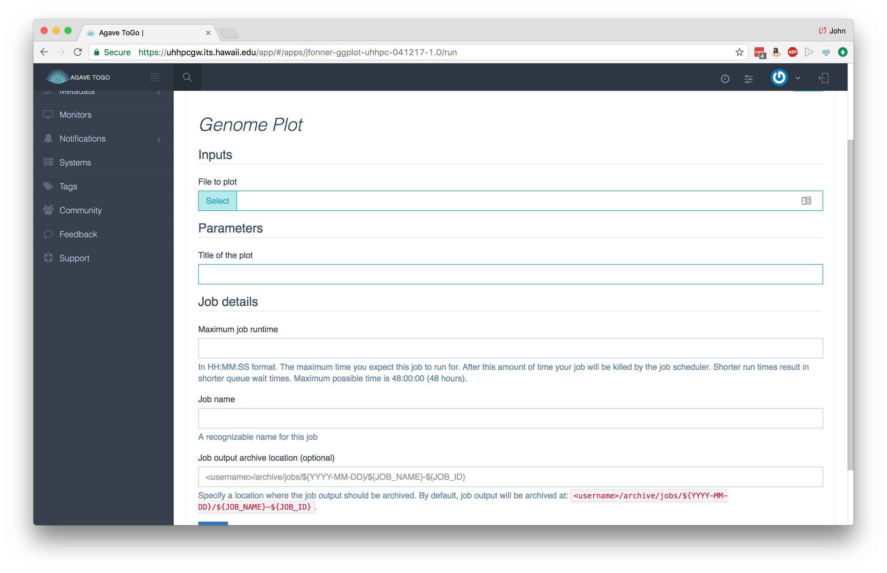

# Apps and jobs 
---

Once you have storage and execution systems registered with Agave, you are ready to to build and use apps.  An Agave App is versioned, containerized executable that runs on a specific execution system.  So, for example, if you have multiple versions of a software package on a system, you would register each version as its own app.  Likewise, for a software package available on multiple execution systems, each system would use a different Agave app to use that software. 

Agave keeps a registry of apps that you can list and search.  The Apps service provides permissions, validation, archiving, and revision information about each app in addition to the usual discovery capability.

## Registering an app  

Registering an app with the Apps service is conceptually simple. Just describe your app as a JSON document and POST it to the Apps service. Historically, this has actually been the hardest part for new users to figure out. So, to ease the process, we've created a couple tools that you can use to define your apps. The first is the <a href="http://agaveapi.co/tools/app-builder/" title="App Builder">App Builder</a> page. On this page you will find a form-driven wizard that you can fill out generate the JSON description for your app. Once created, you can POST the JSON directly to the Apps service. If you are new to app registration, this is a great place to start because it shrinks the learning curve involved in defining your app.

The second tool is the <a href="https://bitbucket.org/taccaci/agave-samples/" title="Agave Samples Repository" target="_blank">Agave Samples</a> project. The Agave Samples project is a set of sample data that cover a lot of use cases. The project contains several app definitions ranging in complexity from a trivial no-parameter, no-argument hello world, to a complex multi-input application with multiple parameter types. The Agave Samples project is a great place to start when building your app by hand because it draws on the experiences of many successful application publishers. 

## Packaging your app  

Agave apps are bundled into a directory and organized in a way that Agave can properly invoke it. Though there is plenty of opportunity to establish your own conventions, at the very least, your application folder should have the following in it:

* An execution script that creates and executes an instance of the application. We refer to this as the <em>wrapper template</em> throughout the documentation. For the sake of maintainability, it should be named something simple and intuitive like `wrapper.sh`. More on this in the next section. 
* A library subdirectory: This contains all scripts, non-standard dependencies, binaries needed to execute an instance of the application.  
* A test directory containing a script named something simple and intuitive like `test.sh`, along with any sample data needed to evaluating whether the application can be executed in a current command-line environment. It should exit with a status of 0 on success when executed on the command line. A simple way to create your test script is to create a script that sets some sensible default values for your app's inputs and parameters and then call your wrapper template. 

The resulting minimal app bundle would look something like the following:

```always
jfonner-ggplot-1.0
|- app.json
|+ bin
 |- script.R
|+ test
 |- test.sh
|- wrapper.sh
```

## An example app

### The app description

Below is a simple app description that takes a single file and one parameter as input and generates a plot.  The app description we give to Agave can be simpler than what is below, but a number of optional fields were included to demonstrate their use.

```json
{
  "name": "USERNAME-ggplot-uhhpc",
  "version": "1.0",
  "label": "Genome Plot",
  "shortDescription": "Plot a genome using ggplot",
  "longDescription": "",
  "tags": [
    "Rscript",
    "ggplot"
  ],
  "deploymentSystem": "jfonner-uhhpc-storage",
  "deploymentPath": "apps/jfonner-ggplot-1.0",
  "templatePath": "wrapper.sh",
  "testPath": "test/test.sh",
  "executionSystem": "jfonner-uhhpc-exec",
  "executionType": "HPC",
  "parallelism": "SERIAL",
  "modules": [
    "load lang/R/3.3.2"
  ],
  "inputs": [{
    "id": "filename",
    "details": {
      "label": "File to plot",
      "description": "",
      "argument": null,
      "showArgument": false
    },
    "semantics": {
      "fileTypes": [
        "text-0"
      ],
      "minCardinality": 1,
      "ontology": [
        "http://sswapmeet.sswap.info/util/TextDocument"
      ],
      "maxCardinality": 1
    },
    "value": {
      "default": "apps/USERNAME-ggplot-uhhpc/test/input.csv",
      "order": 0,
      "required": true,
      "validator": "",
      "visible": true
    }
  }],
  "parameters": [{
    "id": "title",
    "details": {
      "showArgument": false,
      "repeatArgument": false,
      "label": "Title of the plot"
    },
    "semantics": {
      "maxCardinality": 1,
      "ontology": [],
      "minCardinality": 1
    },
    "value": {
      "visible": true,
      "required": true,
      "type": "string",
      "default": "\"Awesome Title\""
    }
  }],
  "outputs": [],
  "defaultQueue": "bioworkshop",
  "checkpointable": false
}
```

Looking at some of the important keywords:
* **name** - Apps are given an ID by combining the "name" and "version". That combination must be unique across the entire Agave tenant, so unless you are an admin creating public system, you should probably put your username somewhere in there, and it's often useful to have the system name somehow referenced there too. You shouldn't use spaces in the name.
* **version** - This should be the version of the software package that you are wrapping.  If you end up updating your app description later on, Agave will keep track of the app revision separately, so there is no need to reflect that here.
* **deploymentSystem** - The data storage system where you keep the app assets, such as the wrapper script, test script, etc.  App assets are not stored on the execution system where they run.  For provenance and reproducibility, Agave requires that you keep them on a storage system.
* **deploymentPath** - the directory on the deploymentSystem where the app bundle is located
* **templatePath** - This template is what Agave uses to run your app.  The path you specify here is relative to the deploymentPath
* **testPath** - The intention here is that you include a testcase inside of your app bundle.
* **argument** - In combination with "showArgument", the "argument" keyword is a convenience that lets you build up commandline arguments in your wrapper script.
* **Cardinality** - Sets the min and max number of files you can give for inputs and outputs.  A "maxCardinality" of -1 will accept an unlimited number of files.

### Wrapper script

We have set this up to have a minimal wrapper script:

```sh
module load lang/R/3.3.2
tar xzf bin.tgz
Rscript ./bin/script.R ${filename} ${title}
```

Within a wrapper script, you can reference the ID of any Agave input or parameter from the app description.  Before executing a wrapper script, Agave will look for the these references and substitute in whatever was that value was.  This will make more sense once we start running jobs, but this is the way we connect what you tell the Agave API that you want to do and what actually runs on the execution system.  The other thing Agave will do with the wrapper script is prepend all the scheduler information necessary to run the script on the execution system.

### Test data

If you have a small set of test data, it can be useful to other developers if you include it in a `test` directory.

```
mkdir test && cd test
wget https://raw.githubusercontent.com/datacarpentry/R-genomics/gh-pages/data/Ecoli_metadata.csv
```

### Test script

In the `test` directory, it is always a good idea to include a test script that can run your app against test data.  In a file called `test.sh` put the following:

```
#!/bin/bash

export filename=$PWD/Ecoli_metadata.csv
export title="\"My Title\""

bash ../wrapper.sh
```

## Registering an app

Once you have an application bundle ready to go, you can register the app with the following CLI command:

```
apps-addupdate -F app.json
```

Agave will check the app description, look for the app bundle on the deploymentSystem, and if everything passes, make it available to run jobs against

## Running a job

Once you have at least one app registered, you can start running jobs.  To run a job, Agave just needs to know what app you want to run and what inputs and parameters you want to use.  There are number of other optional features, which are explained in detail in the [Agave Job Management Tutorial](http://agaveapi.co/documentation/tutorials/job-management-tutorial/)

In Agave ToGo, in the `Apps` section, you can click `Action` on the right and choose `Run`.  It will bring up the jobs interface.



Note that you can specify which queue to use as well as runtime limits in your job.  If those are absent, Agave falls back to whatever was listed in the app description (also optional).  If that app doesn't specify, then it falls back to the defaults given for the execution system.

If you have direct access to the system where you are running the job, it is fun to watch it progress through on the system itself.  You can also use Agave ToGo's `Jobs` view to track job progress.

## What's next?

If you made it this far, you have successfully created a new command line tool using R, you have deployed that tool on an HPC system, and now you can run that tool through the cloud from anywhere!  That is quite a lot in one day.

At this point, it would be a good idea to connect with other developers that are publishing apps and running workflows through Agave by joining the Agave API Slack channel: [slackin.agaveapi.co](https://slackin.agaveapi.co)


## More Resources

Building Agave applications can be very rewarding way to share your code with your colleagues and the world. This is a very simple example. If you are interested to learn more, please check out the [App Management Tutorial](http://developer.agaveapi.co/#apps) on the Agave Developer Portal.

Example JSON descriptions are also available here: https://bitbucket.org/taccaci/agave-samples

[Back](index.md)

